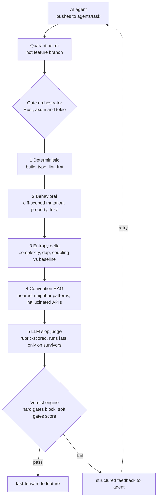
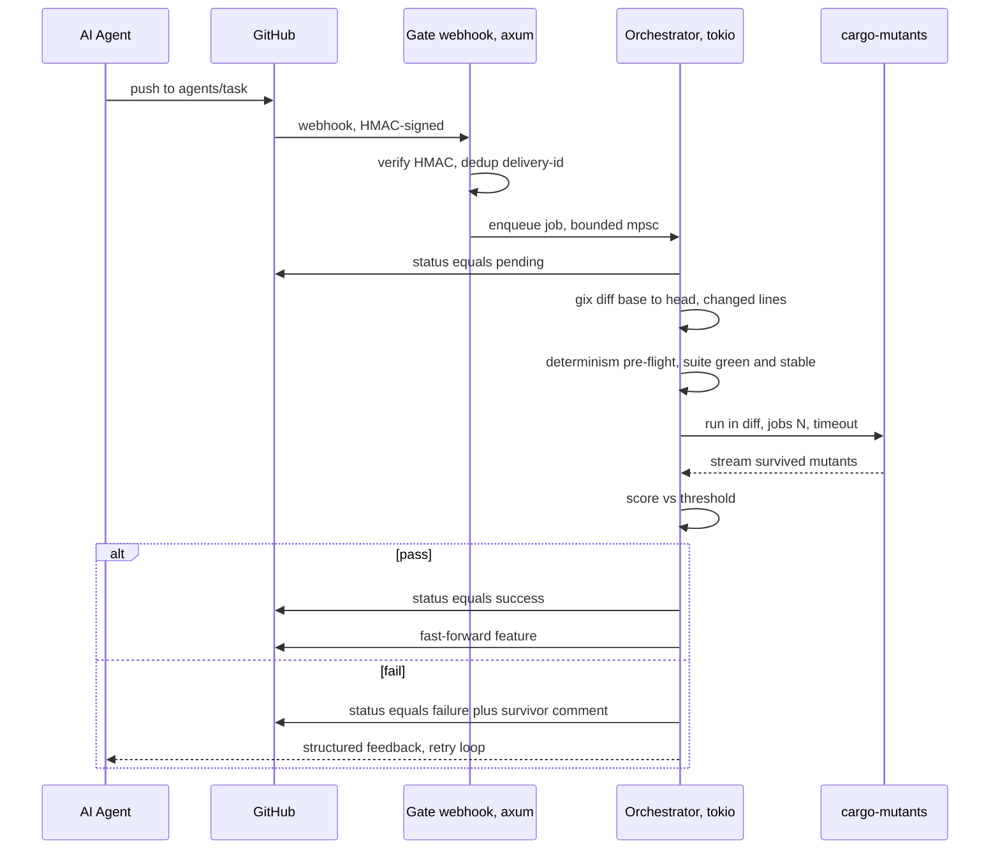
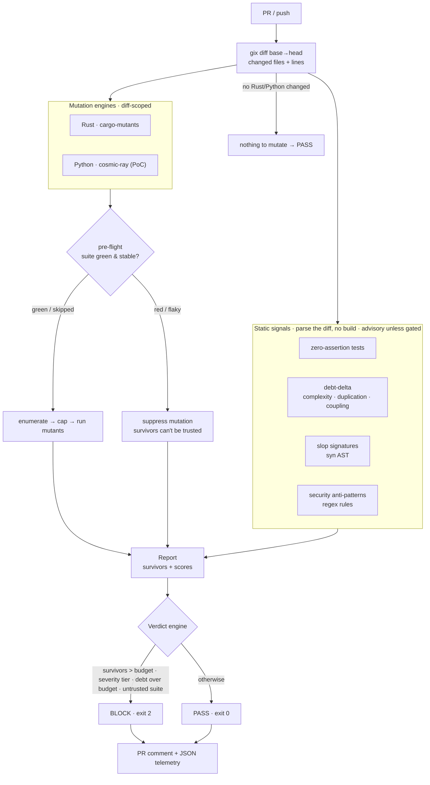
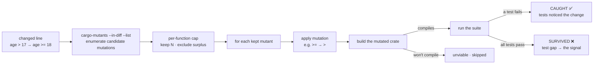

# mergestro-gate — Slop Filter (Behavioral Merge Gate)

A **behavioral merge gate** for AI-generated code: instead of statically
reviewing a PR a human opens, it gates the code an agent writes — by *running*
it — before it becomes a PR a human has to read. The wedge is the empty
quadrant: **enforcing + behavioral**.

The full phased plan (PoC → Deployment → Validation → Rollout → GA) lives in
[`Slop Filter — Behavioral Merge Gate Phased Build P …md`](./Slop%20Filter%20—%20Behavioral%20Merge%20Gate%20Phased%20Build%20P%2037b6325a76db816eba56e4badc023c8e.md).
The forward plan — multi-language support, the pattern-checker lanes, and
commercialization via Mergestro — is in [`ROADMAP.md`](./ROADMAP.md); the
release task list + OSS↔SaaS split is in [`OSS-ROLLOUT.md`](./OSS-ROLLOUT.md).

**Guides:** [`GUIDE.md`](./GUIDE.md) — CI/CD + developer integration, and what the
gate does and does not do. [`test-harness/`](./test-harness) — run the gate in a
network-isolated container against a known survivor.

**Status: Phase 4 — Rollout.** An *installable, blocking* gate: a pure-Rust
(`gix`) diff against the base ref, a blocking verdict wired for branch
protection, a free zero-assertion test pre-check, and an idempotent PR comment —
packaged as a composite GitHub Action ([`action.yml`](./action.yml)). Phase 3
added **validation telemetry**: each run emits a record, and `slop-gate analyze`
reads them into the headline KPIs (fix-vs-override, block rate, latency). Phase 4
starts the rollout: survivors are **ranked by severity** (and can gate on their
own), a **debt-delta budget** tracks net complexity/duplication/coupling with
burn-rate framing, and `analyze` grows a **mutation-score trend dashboard**.
Phase 1's advisory mode is still available via `--advisory`.

**Python (advisory PoC):** changed `.py` files are now mutation-tested too, via
[`cosmic-ray`](https://github.com/sixty-north/cosmic-ray), diff-scoped to the
changed lines and fed through the same verdict, severity ranking and telemetry as
Rust (auto-detected by file extension). See the [integration guide](./GUIDE.md)
for the current limits. CI packaging is opt-in: set the Action's
`enable-python: "true"` to install Python + cosmic-ray (the per-function cap is
still deferred — cosmic-ray has no pre-exec mutant selection).

## Getting started

Three ways to run it — fastest first. Full detail is linked from each.

### Which should I use?

| Your setup | Use | Why |
| ---------- | --- | --- |
| **GitHub Actions** | the **Action** (§1) | Pulls a ~5 MB static binary onto a runner that already has the Rust toolchain. No image to pull. The primary, fastest path. |
| **GitLab CI / Jenkins / other CI** | the **Docker image** (`mancube/mergestro-gate`) | Toolchain + `cargo-mutants` baked in, so the gate runs with zero setup. See [`ci-example/gitlab-ci.yml`](./ci-example/gitlab-ci.yml). ~300 MB pull. |
| **Local / one-off** | the **CLI** (§2) or the image | Build the binary once, or `docker run` the image against a checkout. |

The image is intentionally large — it carries the Rust toolchain because the
behavioral gate compiles + tests each mutant at run time. On GitHub, prefer the
Action and skip the pull entirely.

### 1. Add it to CI (recommended)

Drop the gate into `pull_request` as a status check, **advisory first**:

```yaml
# .github/workflows/slop-gate.yml
on: pull_request
permissions: { contents: read, pull-requests: write }
jobs:
  behavioral-gate:
    runs-on: ubuntu-latest
    steps:
      - uses: actions/checkout@v4
        with: { fetch-depth: 0 }     # full history — the merge-base needs it
      - uses: dtolnay/rust-toolchain@stable
      - uses: Swatinem/rust-cache@v2  # warm target/ — big speedup
      - uses: lucheeseng827/mergestro-gate@v1
        with:
          advisory: "true"           # comment only; never fails the build yet
          comment: "true"
```

Watch ~a dozen PRs, confirm the survivors are real, then flip to blocking
(`advisory` off, make the check **required** in branch protection). Inputs,
exit codes, the advisory→blocking rollout, private-repo tokens, and a
troubleshooting table are all in **[`ACTION.md`](./ACTION.md)**.

### 2. Run it ad-hoc (local / one-off)

Build the CLI once (see [Install as a CLI](#install-as-a-cli)), then point it at
any range — it diffs, mutates the changed lines, and prints a report:

```bash
# advisory report for the current branch vs origin/main (never blocks)
slop-gate --repo . --base origin/main --head HEAD --advisory

# blocking check (exit 2 if it would block); CI already ran the suite green
slop-gate --base origin/main --skip-preflight
```

> The mutation step requires [`cargo-mutants`](https://mutants.rs) — see [Limitations](#limitations).

### 3. Predict the cost first — `estimate` (no build)

Project a diff's mutant count + per-function breakdown + a latency band, without
building or testing — handy before pushing, and works on any platform:

```bash
slop-gate estimate --base origin/main --head HEAD     # add --json for CI
```

### Tune & troubleshoot

- **Make it fast:** `Swatinem/rust-cache`, don't set `CARGO_INCREMENTAL=0`,
  `--test-tool nextest`, `--skip-preflight`, lower `max-per-function`, a bigger
  runner. Full ROI-ordered list in **[`GUIDE.md`](./GUIDE.md) §5**.
- **Common errors** (no merge-base, engine missing, slow runs, Windows) — the
  troubleshooting table in **[`ACTION.md`](./ACTION.md)**.
- **Cost model** — [`BENCHMARK.md`](./BENCHMARK.md): >90% of wall-clock is the
  per-mutant compile-and-test; the orchestrator is ~11 ms.

### Limitations

Read these before relying on the gate (full list: [`GUIDE.md`](./GUIDE.md) §"What
it does NOT do"):

- **Diff-scoped, not a whole-repo audit, not a correctness proof.** It only
  mutates changed lines and samples a class of faults — a clean run means "no
  cheap mutant survived here," not "this is correct."
- **Needs a green, deterministic suite.** No tests / red / flaky ⇒ mutation is
  suppressed (the gate won't certify what it can't trust).
- **Rust is stable; Python/JS/Go/Java engines are experimental PoCs** — advisory,
  no per-function cap, coarser scoping; each needs its tool installed.
- **It costs CI minutes.** Each mutant recompiles + re-runs the suite; bound it
  with the levers above and budget accordingly.
- **Severity / debt / slop scores are heuristics**, advisory unless you opt in to
  gating (`--block-on-severity`, `--block-on-debt`, `--block-on-pattern`).

## Architecture (GA target shape)

The full proactive architecture is the GA shape: a quarantine ref the agent
pushes to, a Rust gate orchestrator running staged checks cheapest-first, and a
closed feedback loop back to the generating agent. Phases PoC → Rollout ship a
thinner slice of this as a GitHub Action (no webhook, no quarantine — the
customer's CI runs the suite).



Order is load-bearing: cheap deterministic checks fail in milliseconds; the LLM
only ever sees code that already compiles and passed behavioral checks, so its
tokens go to slop/debt rather than correctness.

**What Phase 1 implements:** the **behavioral** stage (`2`) only — diff-scoped
mutation — run as a plain script inside the customer's CI. No quarantine ref, no
verdict engine, no fast-forward, no agent feedback loop. Those are GA pieces.

## Event call flow (GA webhook path)



For Phase 1 the same diff → pre-flight → mutate core runs *inside* a job on
`pull_request` instead of behind a webhook: no HMAC, no quarantine, no
fast-forward, no scoring/feedback — just diff → pre-flight → mutate → advisory
report. The expensive execution infrastructure is deferred to GA, after the
thesis is proven.

## What Phase 1 proves

> Does the catch happen, fast enough?

A *differential mutation gate* surfaces real survivors the test suite passed
over, within a workable runtime. It is deliberately a "plain Rust script" — no
webhook, no quarantine ref, **no blocking**. It runs inside one repo's CI and
prints an advisory report.

### Pipeline (Phase 2)

```text
 gix diff (base→head)  ─►  zero-assertion  ─►  determinism  ─►  cargo-mutants  ─►  verdict + report
   Rust-only               static pre-check     pre-flight        --in-diff          block / pass
   short-circuits          (free 2nd signal)    green & stable    per-function cap    PR comment
   non-Rust diffs                               suppresses if     bounds runtime      exit 0 / 2
                                                red or flaky
```

Order is load-bearing: a non-Rust diff or a red/flaky suite short-circuits
*before* paying for any mutation runtime. The **verdict engine** then turns the
report into a decision — hard gates (survivors over budget, untrustworthy suite)
block; soft signals (assertion-free tests) score unless explicitly gated.

### Efficiency levers (where the cost actually is)

- **`--in-diff`** scopes mutation to changed lines only.
- **Per-function mutant cap** (`max_mutants_per_function`, default 5) bounds the
  mutant count — the dominant runtime driver. The gate lists candidates, keeps
  the first *N* per function, and excludes the surplus from the run via anchored
  `--exclude-re` patterns.
- **`--jobs`** parallelises across cores (defaults to `min(cores, 8)`).
- Warm/reuse `target/` in CI so the baseline build isn't re-paid each run.
- **Workspace scoping** — the gate passes `--package` to *mutate* only the changed
  crate(s); by default it still runs the whole workspace's tests against each
  mutant (`--test-workspace`) so downstream catches aren't lost. `--test-changed-package-only`
  narrows tests for speed (may surface downstream-only false survivors).
- **`--skip-preflight`** also passes `--baseline skip` to cargo-mutants — when CI
  already proved the suite green, the engine needn't re-run an unmutated baseline.
- **`--test-tool nextest`** runs the suite with `cargo-nextest` (per-process,
  parallel) — often a 2–3× faster test phase. The JS engine already prunes tests
  per mutant via Stryker's `coverageAnalysis: perTest`.
- Keep **`CARGO_INCREMENTAL`** unset/`1` in CI — `0` forces a full recompile per
  mutant. See [`GUIDE.md`](./GUIDE.md) §5 for the full tuning list.

These levers are measured, not asserted: [`BENCHMARK.md`](./BENCHMARK.md) is the
COGS baseline (orchestrator overhead, cost breakdown, cross-engine per-mutant cost),
reproducible via [`bench/`](./bench). Headline: the Rust orchestrator is a flat
~11 ms — <5% on a realistic diff — so >90% of wall-clock is the engine's
compile-and-test cycle, which is where the optimization headroom is.

## How a change is validated (as-built decision flow)

The diagram at the top is the GA *target*. This is what the gate does **today**:
a diff is fanned out to cheap static signals and the per-language mutation
engines, the results are aggregated, and the verdict engine decides pass/block.



### How a mutant is detected from a code change

The behavioral signal. cargo-mutants enumerates small behaviour-changing edits
**on the changed lines only**, then for each one rebuilds and re-runs the suite.
A mutant the tests *don't* notice is a **survivor** — a hole in your tests on
exactly the surface this PR touched.



### Validation modes (what each signal is, and whether it gates)

| Signal | How | Cost | Default |
| ------ | --- | ---- | ------- |
| **Behavioral mutation** (Rust `cargo-mutants`, Python `cosmic-ray` PoC) | mutate changed lines, re-run the suite per mutant | high (build+test/mutant) | survivors over budget **block** |
| **Determinism pre-flight** | run the suite N× — must be green & stable before trusting survivors | one suite run | red/flaky **blocks** (mutation suppressed) |
| **Zero-assertion check** | static: changed tests that execute but assert nothing | ~free | advisory (`--block-on-zero-assertion`) |
| **Severity ranking** | tier each survivor `critical`→`low` by location + mutation kind | ~free | advisory (`--block-on-severity`) |
| **Debt-delta** | net complexity/duplication/coupling the diff adds | ~free | advisory (`--block-on-debt`) |
| **Slop signatures** | static `syn` AST: redundant wrappers, tautological asserts, over-commenting | ~free | advisory |
| **Security anti-patterns** | static regex: hardcoded secrets, weak hash, SQL-in-format!, shell spawns | ~free | advisory |

Order is load-bearing: a non-Rust/Python diff or a red suite short-circuits
*before* paying any mutation runtime; the cheap static lanes run regardless, so
you still get a signal even when mutation is suppressed.

## Install as a GitHub Action (recommended)

> Full wiring guide — inputs, exit codes, advisory→blocking rollout, private
> repos, troubleshooting — in [`ACTION.md`](./ACTION.md).

Add the gate as a required check on `pull_request` — see
[`ci-example/pull_request.yml`](./ci-example/pull_request.yml):

```yaml
permissions:
  contents: read
  pull-requests: write       # so the gate can comment
jobs:
  behavioral-gate:
    runs-on: ubuntu-latest
    steps:
      - uses: actions/checkout@v4
        with: { fetch-depth: 0 }   # full history for the merge-base
      - uses: dtolnay/rust-toolchain@stable
      - uses: Swatinem/rust-cache@v2
      - uses: lucheeseng827/mergestro-gate@main
        with:
          max-survivors: "0"            # any survivor blocks
          block-on-severity: "high"     # Phase 4: also block on a high/critical survivor
          comment: "true"
          metrics-file: "slop-gate-metrics.jsonl"   # Phase 3: emit telemetry
```

The action resolves the merge-base with `git merge-base` and passes it to the
gate; it installs a prebuilt static **musl** binary from the
[release](../../../.github/workflows/slop-gate-release.yml) (building from source
only if the release is missing), so cold start stays fast. Make the check
**required** in branch protection to actually block merges.

## Install as a CLI

The gate shells out to [`cargo-mutants`](https://mutants.rs):

```bash
cargo install cargo-mutants
cargo build --release   # binary: target/release/slop-gate
```

> **Platform note:** the mutation step requires **Linux** (the Action runs on
> `ubuntu-latest`). On Windows, `cargo-mutants` currently fails with a recursive
> temp-path error (`MAX_PATH`), so it can't test mutants there. The gate guards
> against this — if the engine accounts for fewer mutants than it enumerated, the
> run is reported as an operational failure (exit `1`) rather than a silent pass.
> For a Windows end-to-end run, use the [`test-harness/`](./test-harness) container.

## Usage

```bash
# Blocking gate for the current branch vs origin/main (exit 2 if blocked)
slop-gate --repo . --base origin/main --head HEAD

# Dry run — project mutant count + per-function breakdown + latency, no build
slop-gate estimate --base origin/main --head HEAD          # add --json for CI

# Advisory mode — report but never block (Phase 1 behaviour)
slop-gate --base origin/main --advisory

# Allow up to 2 survivors; emit JSON for CI consumption
slop-gate --base origin/main --max-survivors 2 --format json

# Post / update the PR comment (uses the GitHub Actions environment)
slop-gate --base origin/main --comment

# CI already ran the suite green — skip the pre-flight
slop-gate --base origin/main --skip-preflight
```

All flags also live in a YAML config — see
[`mergestro-gate.example.yaml`](./mergestro-gate.example.yaml). CLI flags override the
file; the file overrides the defaults.

### Exit codes

| Code | Meaning |
| ---- | ------- |
| `0`  | Gate ran and **passed** (or `--advisory`): nothing over budget. |
| `2`  | Gate **blocked**: survivors over budget, an untrustworthy suite, or (if enabled) assertion-free tests. This is what fails the required check. |
| `1`  | Operational failure: couldn't diff, `cargo-mutants` missing, etc. |

The PR comment is best-effort — a token/network hiccup warns but never changes
the verdict or fails the step on its own.

## Validation telemetry (Phase 3)

Phase 3 is a *data* phase — prove teams keep the gate on and act on survivors,
and pin the ICP from real usage. That can only be decided if the gate **emits**
the right signal, so each run can append a compact JSON-Lines record:

```bash
slop-gate --base origin/main --metrics-file slop-gate-metrics.jsonl
#   …or POST it to a sink (Bearer token from $METRICS_TOKEN):
slop-gate --base origin/main --metrics-url https://example.com/ingest
```

Each record carries exactly the keys the Phase 3 questions need: survivor counts
and per-survivor *fingerprints* (line-independent, so a survivor can be traced
across an evolving PR), the run mode (blocking vs advisory) and verdict, latency,
and repo/PR/commit identity. Read it back into the headline KPIs:

```bash
slop-gate analyze --metrics-file slop-gate-metrics.jsonl
# ── Slop Filter · validation & trend summary (Phase 3–4) ──
# runs:       128 across 4 repo(s), 37 PR(s)
# mode:       120 blocking · 8 advisory
# block rate: 22% (26 of 120 blocking runs blocked)
# survivors:  41 total, in 26 run(s)
# acted-on:   78% (32 fixed, 9 carried)      ← fix-vs-override
# latency:    mean 47.3s · p50 41.0s · p95 92.5s
# mut-score:  mean 86% · trend +4% (improving)   ← Phase 4 trend dashboard
# severity:   2 critical · 5 high · 18 medium · 16 low
# debt-delta: +37 net across all runs
```

`acted-on` is the fix-vs-override rate: a survivor fingerprint that disappears in
a later run of the same PR is *fixed*; one still present in the PR's latest run
is *carried* (overridden / not yet addressed). "Disable rate" and "kept enabled
≥ 1 month" are judged from the *trend* of these records over calendar time — a
disabled gate emits nothing — which is an ingestion-side concern.

**Deferred (the non-code part of Phase 3):** recruiting 3–5 design partners
matching the ICP, and adding Python only if a partner pulls for it.

## Severity ranking & debt-delta budget (Phase 4)

Phase 4 is the rollout: make the catch *actionable at scale*. Two engineering
levers ship here (the go-to-market — self-serve, pricing, Python/JS engine
adapters — is deferred).

**Severity ranking.** Not every survivor is equally dangerous: a flipped `>=`
in a permission check is a latent auth bypass; the same flip in a log formatter
is cosmetic. Each survivor is classified into `critical` / `high` / `medium` /
`low` from two cheap signals — *where* it lives (auth/permission/crypto/validate
paths rank up, logging/formatting paths rank down) and *what* it does
(control-flow mutations outrank arithmetic). The report and PR comment list
survivors **most-dangerous-first**, and a team can tighten the gate to block on a
tier regardless of count:

```bash
# Block any survivor at or above "high", even if it's within the count budget
slop-gate --base origin/main --block-on-severity high
```

**Gate a pattern lane (opt-in).** The slop / security / convention lanes are
advisory by default; turn any into a hard gate by lane name or specific rule id:

```bash
# Block on any security anti-pattern, or on a hallucinated-import anywhere
slop-gate --base origin/main --block-on-pattern security,unknown-crate-import
# Or gate one rule only — e.g. never merge a hardcoded secret
slop-gate --base origin/main --block-on-pattern hardcoded-secret
```

**Debt-delta budget.** Mutation testing is a point-in-time check; the debt-delta
turns it into a trajectory. Computed straight from the diff the gate already
produces, it measures the *net* structural debt a change adds — `added − removed`
across three proxies: **complexity** (decision points), **duplication** (repeated
added lines) and **coupling** (`use` imports). It's framed against a per-PR
budget with a burn-rate, advisory by default:

```bash
# Report the debt-delta every run; block when it exceeds the budget
slop-gate --base origin/main --debt-budget 25 --block-on-debt
```

Both feed the telemetry, so `slop-gate analyze` shows the **mutation-score
trend** (is the suite getting better at catching?), the **severity mix**, and the
**net debt** across runs — the trend dashboard above.

**Deferred (the non-code part of Phase 4):** self-serve install / open beta,
pricing experiments mirroring compute cost, Python to GA (JS if demand warrants,
via `mutmut`/`Stryker` engine adapters), and property + fuzz on changed
entrypoints.

## Try it — the theater-test known-positive

[`fixtures/theater_demo`](./fixtures/theater_demo) is a standalone crate with a
boundary function and a *theater test* that exercises it without asserting the
boundary. A `>=` → `>` mutation survives — exactly the slop Phase 1 should
surface:

```bash
cd fixtures/theater_demo
git init -q && git add -A && git commit -qm "baseline"
# …make an edit on the boundary line, commit, then:
slop-gate --base HEAD~1 --head HEAD
```

## Layout

| File | Responsibility |
| ---- | -------------- |
| `src/config.rs`        | Thresholds, caps, gating flags — defaults + YAML, validated. |
| `src/diff.rs`          | Pure-Rust `gix` diff `base→head` → diff file + changed Rust/Python files. |
| `src/preflight.rs`     | Determinism pre-flight: suite green & stable across N runs. |
| `src/engine.rs`        | `MutationEngine` trait + the Rust/Python adapters — the language seam (add a language = implement it). |
| `src/mutants.rs`       | List → per-function cap → run `cargo-mutants` → parse outcomes (Rust). |
| `src/python.rs`        | Python adapter: drive `cosmic-ray` over changed `.py` lines (PoC). |
| `src/js.rs`            | TS/JS adapter: drive `Stryker` over changed `.js`/`.ts` files, scope to changed lines (PoC). |
| `src/golang.rs`        | Go adapter: drive `gremlins` over the module, scope the report to changed `.go` lines (PoC). |
| `src/jvm.rs`           | Java/Kotlin adapter: drive `PIT` (Maven/Gradle), scope `mutations.xml` to changed lines (PoC). |
| `src/zero_assertion.rs`| Static pre-check: tests on the changed surface that assert nothing. |
| `src/verdict.rs`       | Verdict engine: hard gates block (survivors, severity, debt), soft signals score. |
| `src/severity.rs`      | Phase 4: rank survivors `critical`→`low` by location + mutation kind. |
| `src/debt.rs`          | Phase 4: debt-delta (net complexity/duplication/coupling) from the diff. |
| `src/pattern.rs`       | Shared pattern-lane types (`PatternFinding`/`PatternReport`) + scoring. |
| `src/slop.rs`          | Pattern lane (Track B): AI-slop signatures via `syn` AST → advisory slop score. |
| `src/security.rs`      | Pattern lane (Track B): security anti-patterns via diff-scoped regex rules. |
| `src/convention.rs`    | Pattern lane (Track B): hallucinated-import detection (`use` of an undeclared crate). |
| `src/github.rs`        | Idempotent PR comment via the GitHub REST API (`ureq`). |
| `src/report.rs`        | `Mutant`, `Verdict`, `GateReport`; text / JSON / Markdown rendering. |
| `src/pipeline.rs`      | Orchestration with stage-by-stage short-circuits. |
| `src/runner.rs`        | `CommandRunner` trait over subprocesses (keeps logic testable). |
| `src/metrics.rs`       | Per-run validation telemetry (`RunMetrics`, JSON-Lines + HTTP). |
| `src/analyze.rs`       | Read telemetry back into the KPIs + trend (`ValidationSummary`). |
| `src/estimate.rs`      | Dry-run projection: enumerate + cap → mutant count/latency, no build. |
| `src/main.rs`          | `slop-gate` CLI (gate run + `analyze` + `estimate` subcommands). |
| `action.yml`           | Composite GitHub Action (prebuilt-binary install + run). |

## Roadmap (next phases)

- **Phase 2 — Deployment:** ✅ installable GitHub Action, pure-Rust `gix` diff,
  **blocking** verdict, idempotent survivor PR comment, zero-assertion pre-check,
  prebuilt musl release + `target/` caching.
- **Phase 3 — Validation:** ✅ per-run validation telemetry + `analyze` KPIs
  (fix-vs-override, block rate, latency). Deferred: design partners, Python.
- **Phase 4 — Rollout:** ✅ severity ranking (+ optional severity gate),
  debt-delta budget with burn-rate framing, mutation-score trend dashboard, and
  a ✅ **Python adapter (advisory PoC)** via `cosmic-ray`. Deferred: self-serve /
  open beta, pricing experiments, JS engine adapter, property + fuzz, and Python
  parity (CI/Action packaging, per-function cap, AST-based severity/debt).
- **Phase 5 — GA:** hosted quarantine-ref model, closed agent feedback loop,
  convention RAG, LLM slop judge.
