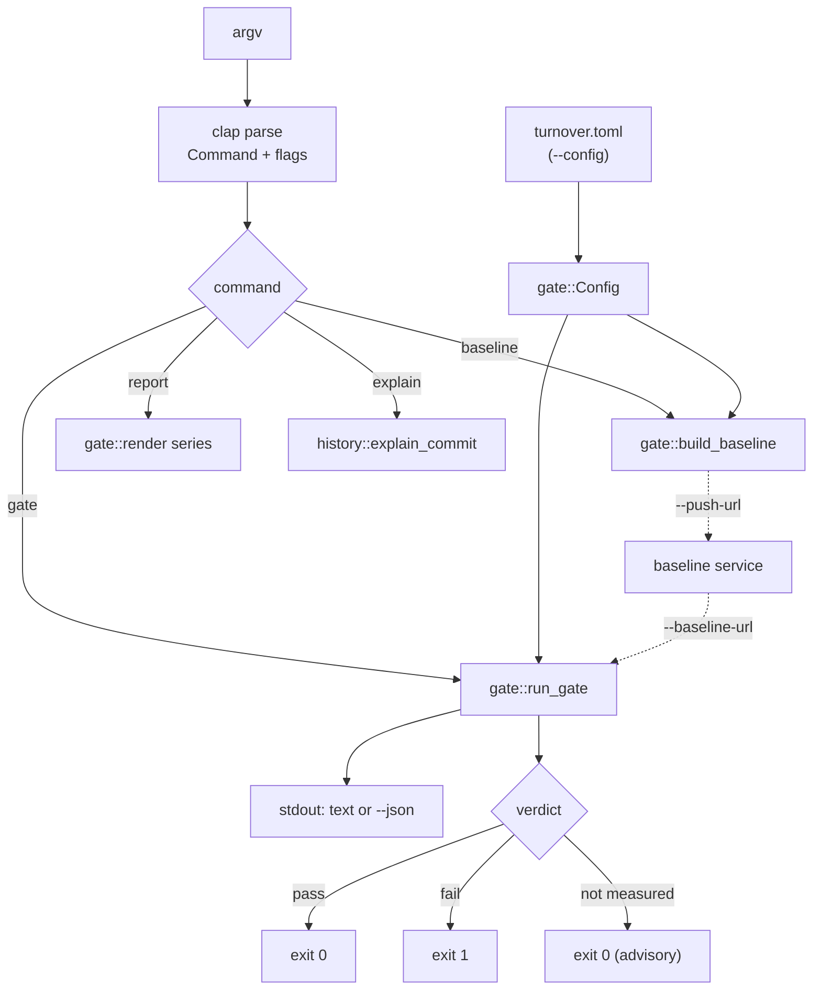
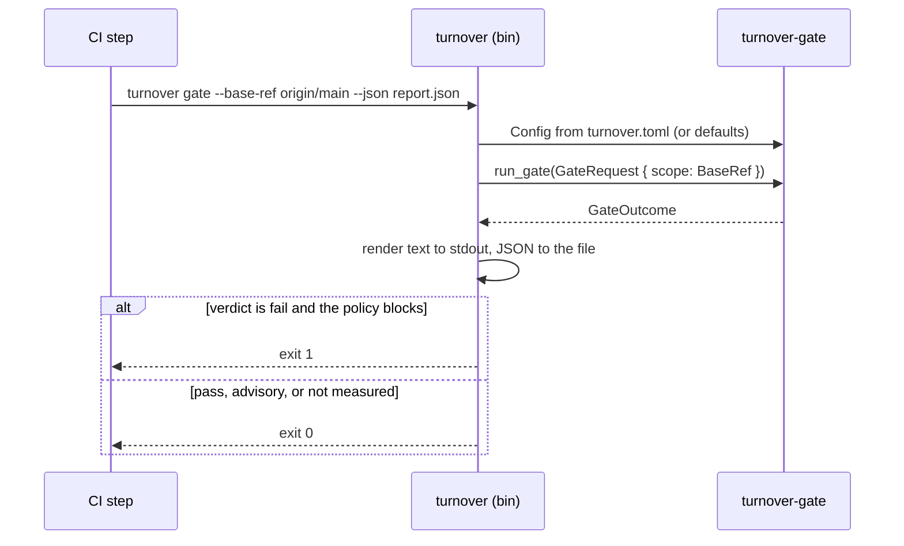

# turnover (CLI)

Argument parsing over `turnover-gate`; nothing is decided here.

```text
turnover baseline            walk history once (then incrementally) into .turnover/baseline.json
turnover gate                trailing window vs the baseline; exit 1 on fail (blocking mode)
turnover gate --base-ref X   only the commits this branch adds over X
turnover report              the trend series the baseline already contains
turnover explain <rev>       per-file, per-line classification of one commit
```

`--baseline-url` / `--push-url` talk to the Mergestro plane's baseline service. See the
module [README](../../README.md) for the policy file and the exit codes.

## Architecture



## Call flow



## Quickstart

```console
$ turnover baseline                       # once, with full history
turnover: baseline .turnover/baseline.json — 59 new commits classified, 59 total (2.1s)
turnover: whole-history ratios — copy/paste 26.4% · dup block 17.5% · refactor 0.8% · churn 1.8%

$ turnover gate --base-ref origin/main    # in the pull request
turnover: window = commits in HEAD not in origin/main (7 commits): 2 authors, 1204 significant lines added
turnover: baseline = 59 commits, 52052 significant lines added (2026-08-14 → 2026-09-01)
  signal       window  baseline   checks
  copy/paste    27.7%     24.4%   drift 29.4% ok
  dup block     17.6%     17.5%   drift 22.5% ok
  refactor       0.9%      0.6%   drift -4.4% ok
  churn          2.3%      0.9%   drift 5.9% ok
verdict: PASS (blocking)
```

Add `--json report.json` for the machine-readable verdict and `--emit records.jsonl` for the
Mergestro telemetry line. Exit code 1 means the policy blocked; 2 means the run itself failed.
