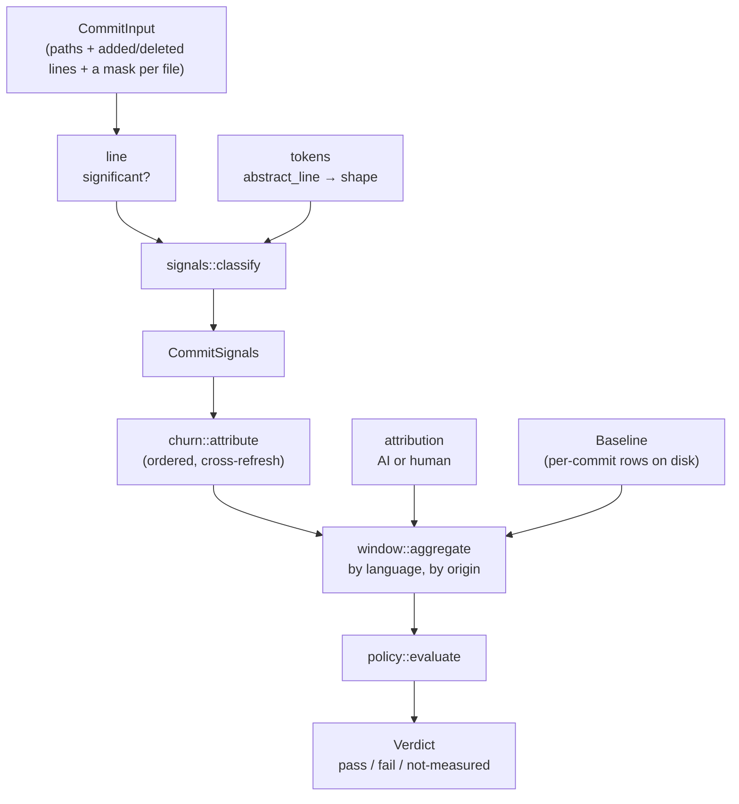
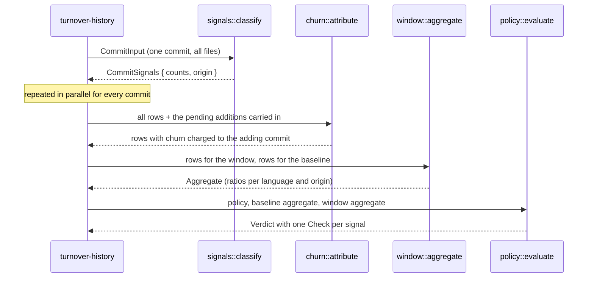

# turnover-core

The signal model, pure. Strings in, counts out: no git, no filesystem, no clock, no parser
runtime. A classification bug is the only way the gate can fail a build for the wrong reason,
so this crate is the surface to audit, and `cargo test -p turnover-core` tests it with nothing
but strings.

| module | what it decides |
|---|---|
| `line` | which lines are *significant* (the denominator of every ratio) |
| `tokens` | the per-language abstraction behind rename-insensitive block matching |
| `signals` | one commit → added / deleted / moved / copy-pasted / duplicated-block counts, with explanations |
| `churn` | additions deleted again within the horizon, attributed to the adding commit |
| `attribution` | AI-coauthored or human, from commit metadata only |
| `window` | aggregates over time ranges, per language and per origin |
| `baseline` | the append-only per-commit file format |
| `policy` | absolute caps, drift limits and the insufficient-sample rule → a verdict |

See the module [README](../../README.md) and the ADRs under [`docs/adr`](../../docs/adr).

## Architecture



Every arrow carries plain data. Nothing in this crate opens a file, reads the clock, or
shells out, which is why the whole model is testable with string literals.

## Call flow



## Quickstart

```rust
use turnover_core::line::heuristic_mask;
use turnover_core::{classify, CommitInput, FileChange, Language, Origin, SignalConfig};

let body = "fn total(items: &[u64]) -> u64 {\n    items.iter().sum()\n}\n";
let commit = CommitInput {
    sha: "abc123".into(),
    parent: None,
    timestamp_unix: 0,
    author: "dev@example.com".into(),
    is_merge: false,
    origin: Origin::Human,
    files: vec![FileChange {
        path: "src/lib.rs".into(),
        language: Language::Rust,
        old: None,
        new: Some(body.to_string()),
        old_mask: None,
        new_mask: Some(heuristic_mask(Language::Rust, body)),
    }],
};

let signals = classify(&commit, &SignalConfig::default());
assert_eq!(signals.counts.added, 2); // the bare `}` is punctuation, never significant
```

`cargo test -p turnover-core` runs the whole model on string fixtures — no repository needed.
