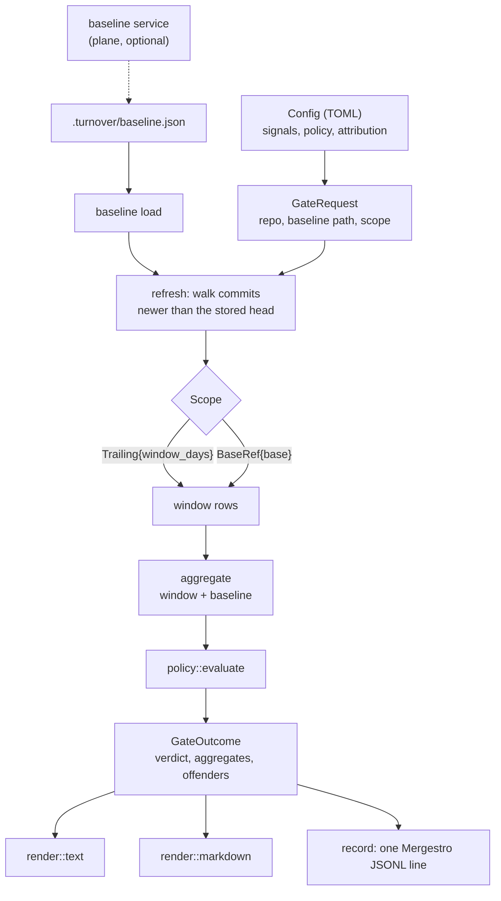

# turnover-gate

The gate as a library. Everything a front-end needs to turn a repository plus a policy into a
verdict: the TOML config, the baseline on disk (build once, refresh incrementally), window
selection (trailing or PR scope), evaluation, the text and Markdown reports with the origin
split and the "where it comes from" offenders, the Mergestro record, and the baseline-service
client. The `turnover` binary and the turnover lane inside the Mergestro gate (`mergestro-gate`)
both call this crate and nothing else, so a change fails for the same reason on both paths.

See the module [README](../../README.md).

## Architecture



## Call flow

```mermaid
sequenceDiagram
    participant F as front-end (CLI or Mergestro lane)
    participant G as turnover-gate
    participant R as baseline service
    participant H as turnover-history
    F->>G: remote::fetch (when baseline_url is set)
    G->>R: GET /v1/turnover/baseline/{repo}
    R-->>G: the stored file, or 404
    F->>G: run_gate(GateRequest)
    G->>H: walk the commits the baseline has not seen
    H-->>G: rows + still-open additions
    G->>G: aggregate the window and the baseline, evaluate the policy
    G-->>F: GateOutcome (verdict, checks, offenders)
    F->>G: render::markdown / record::line
    G-->>F: PR comment section, one telemetry line
    F->>G: remote::push (advisory; a failure only warns)
    G->>R: PUT /v1/turnover/baseline/{repo}
```

## Quickstart

```rust
use turnover_gate::{render, run_gate, Config, GateError, GateRequest, Scope};

fn gate_this_pr() -> Result<(), GateError> {
    let mut req = GateRequest::new(".", Config::default());
    req.scope = Scope::BaseRef("origin/main".to_string());
    req.update_baseline = false;

    let outcome = run_gate(&req)?;
    println!("{}", render::text(&outcome));
    Ok(())
}
```

A missing baseline is not an error: the outcome comes back *not measured*, with the reason to
print, because a gate that cannot measure must never fail a build.
