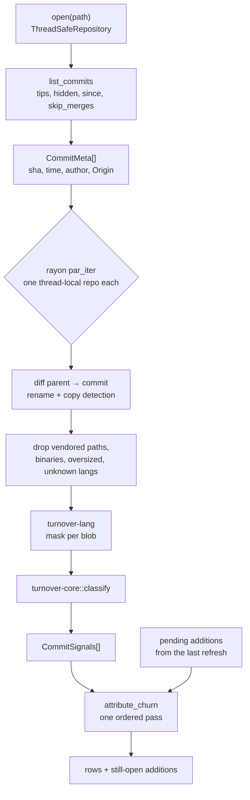
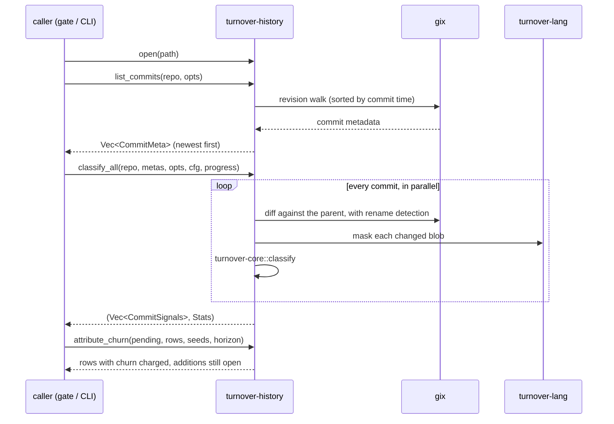

# turnover-history

The git side, in pure Rust via `gix`: list the commits to classify (with origin attribution
from the author and message), load both sides of every changed blob with rename and copy
detection, drop what should never be counted (vendored paths, binaries, oversized files,
unknown languages), and drive `turnover-core` over every commit in parallel with rayon. Churn
attribution runs afterwards as one ordered pass, carrying the still-open additions across
incremental refreshes.

Merge commits are skipped by default: their first-parent diff would re-attribute a whole
branch to one commit and one author.

See the module [ARCHITECTURE](../../ARCHITECTURE.md).

## Architecture



## Call flow



## Quickstart

```rust
use turnover_core::SignalConfig;
use turnover_history::{classify_all, list_commits, open, Error, WalkOptions};

fn walk_head() -> Result<(), Error> {
    let repo = open(".")?;
    let opts = WalkOptions {
        tips: vec!["HEAD".to_string()],
        ..Default::default()
    };
    let metas = list_commits(&repo, &opts)?;
    let (rows, stats) = classify_all(&repo, &metas, &opts, &SignalConfig::default(), &|_done| {})?;

    println!(
        "{} commits, {} rows, {} lines parsed",
        metas.len(),
        rows.len(),
        stats.lines_parsed
    );
    Ok(())
}
```

`cargo test -p turnover-history` builds a synthetic repository with the `git` CLI and checks
the buckets against the unit model, so the walk and the classifier cannot drift apart.
