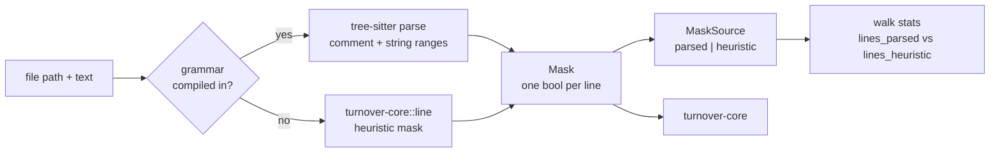
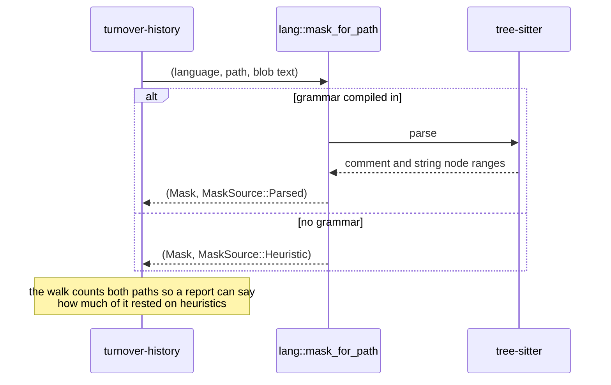

# turnover-lang

The tree-sitter significance oracle, and the only C build in the workspace. It parses a file
once and hands `turnover-core` a per-line mask (comment, docstring, blank, punctuation-only
lines never count); the AST never crosses the boundary, so the model cannot become
grammar-dependent by accident.

Grammars compiled in: Rust, Python, JavaScript, TypeScript (TSX by extension), Go, Java.
Every other language falls back to the heuristic mask in `turnover-core::line`, and the walk
reports how many lines rested on which path.

See the module [README](../../README.md) and ADR-0003.

## Architecture



The AST stops here. Only the per-line mask crosses into `turnover-core`, so adding a grammar
can never change what a signal *means* — only how accurately a line is judged significant.

## Call flow



## Quickstart

```rust
use turnover_core::Language;
use turnover_lang::{mask_for_path, MaskSource};

let src = "// a note\nlet x = 1;\n";
let (mask, source) = mask_for_path(Language::Rust, "src/lib.rs", src);

assert_eq!(source, MaskSource::Parsed);
assert_eq!(mask, vec![false, true]); // the comment does not count, the binding does
```

`cargo test -p turnover-lang` builds the grammars, so the first run is the slow one.
